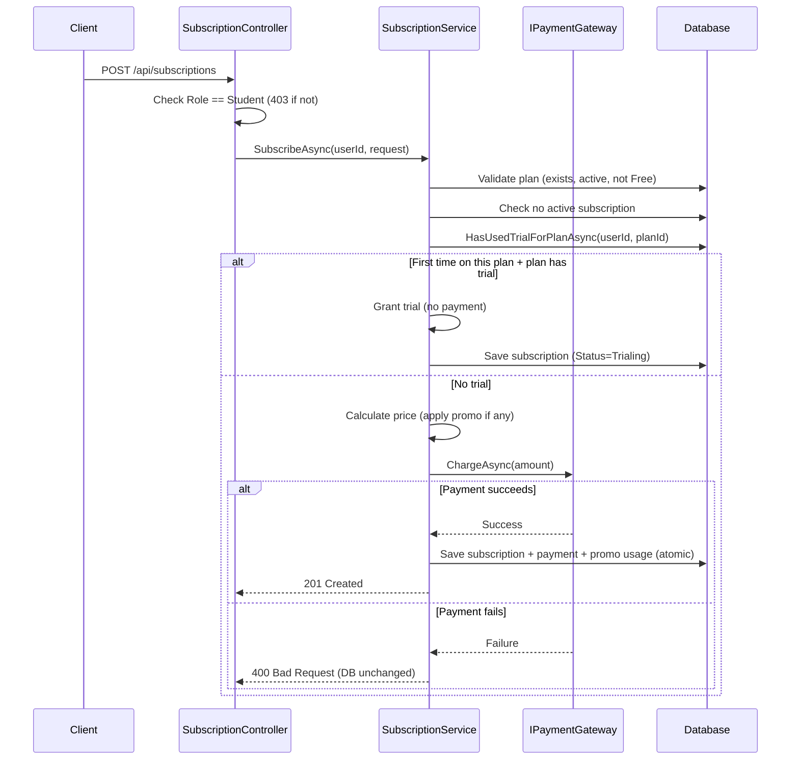
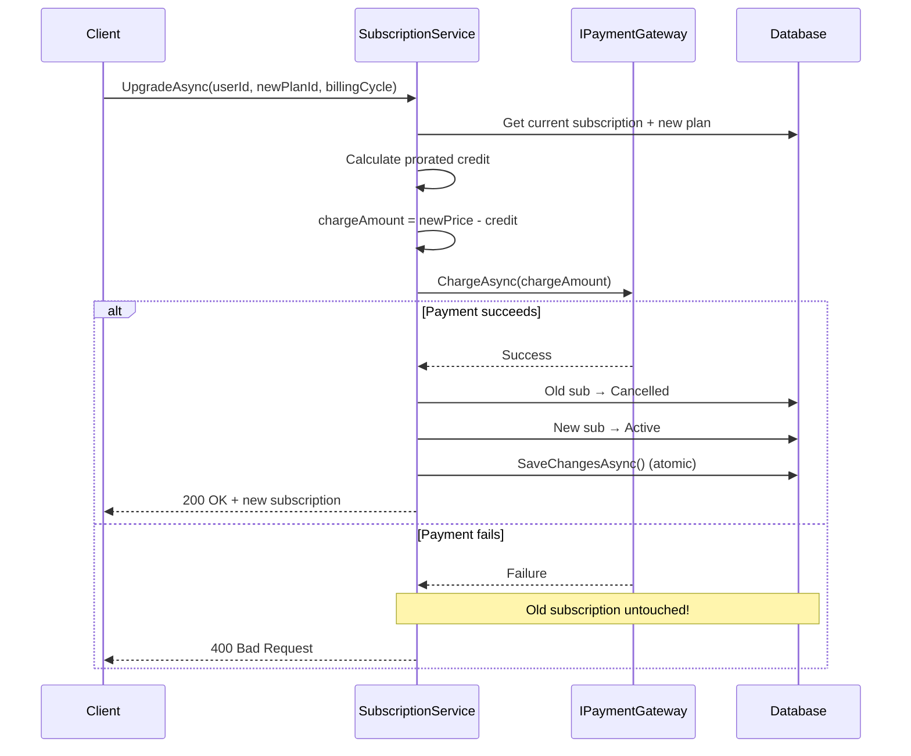
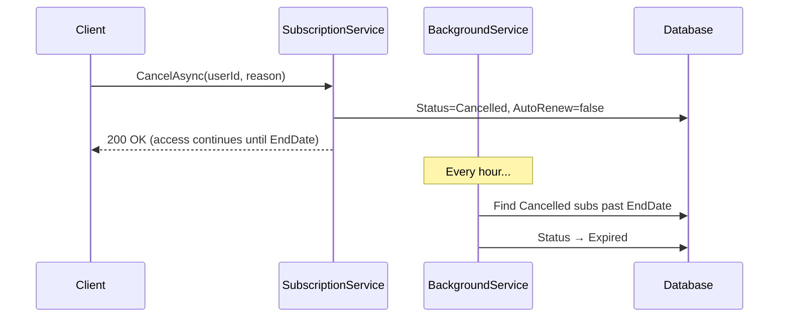
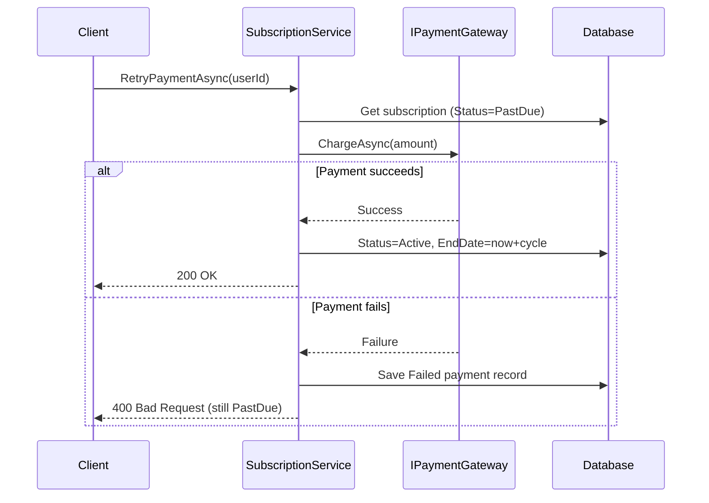
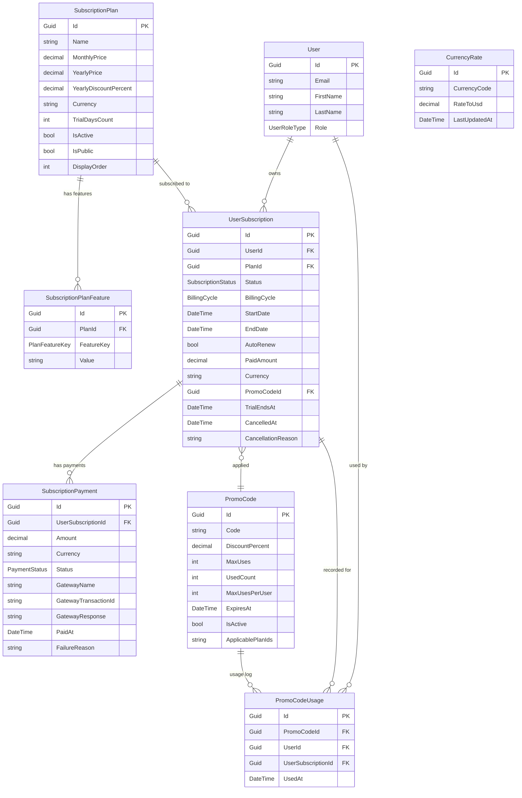
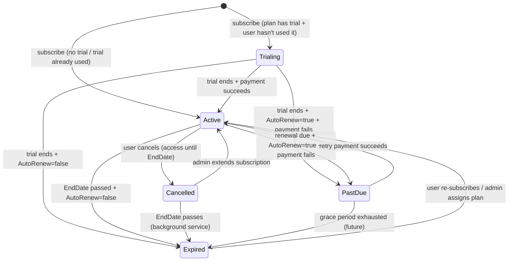

# TAIF Subscription System — Technical Reference

> **Version:** 3.0 · **Stack:** .NET 8 / C# 12 / EF Core 9 · **Gateway:** MockPaymentGateway (swap-ready)

---

## Table of Contents

1. [Quick Start Guide](#1-quick-start-guide)
2. [How It Works — Core Workflows](#2-how-it-works--core-workflows)
3. [Business Rules](#3-business-rules)
4. [API Reference](#4-api-reference)
5. [Entity Relationship Diagram](#5-entity-relationship-diagram)
6. [Subscription Status Lifecycle](#6-subscription-status-lifecycle)
7. [Feature Flag System](#7-feature-flag-system)
8. [Promo Code System](#8-promo-code-system)
9. [Currency Conversion](#9-currency-conversion)
10. [Background Processing](#10-background-processing)
11. [Mock Payment Gateway](#11-mock-payment-gateway)
12. [How-To Guides](#12-how-to-guides)
13. [Architecture Overview](#13-architecture-overview)
14. [Configuration Reference](#14-configuration-reference)
15. [Database Setup & Migrations](#15-database-setup--migrations)
16. [Replacing the Payment Gateway](#16-replacing-the-payment-gateway)
17. [Security Checklist](#17-security-checklist)
18. [Known Limitations & Roadmap](#18-known-limitations--roadmap)

---

## 1. Quick Start Guide

### What Is This?

A subscription system that lets **Students** subscribe to paid plans (Basic / Pro), manage billing, apply promo codes, and unlock premium features. Admins can assign plans, manage promo codes, set currency rates, and view statistics.

### Setup in 3 Steps

```bash
# 1. Apply database migration
dotnet ef database update --project TAIF.Infrastructure --startup-project TAIF

# 2. Seed plans + currency rates
dotnet run --project TAIF -- seed all

# 3. Run the app
dotnet run --project TAIF
```

### Current Plans

| Plan | Monthly | Yearly | Trial | Paid Courses | Learning Paths | Video Quality |
|------|---------|--------|-------|--------------|----------------|---------------|
| **Free** | $0 | $0 | — | ❌ | ❌ | 480p |
| **Basic** | $10 | $84 (30% off) | 30 days | ✅ | ✅ | 1080p |
| **Pro** | $25 | $210 (30% off) | — | ✅ | ✅ | 1080p |

> **Note:** The Pro plan is seeded with `IsActive = false` and `IsPublic = false` (admin-assigned only).

### Who Can Do What?

| Action | Student | Admin / SuperAdmin | ContentCreator |
|--------|---------|-------------------|----------------|
| View plans | ✅ | ✅ | ✅ |
| Subscribe / Upgrade / Cancel | ✅ | ❌ (403) | ❌ (403) |
| Retry payment | ✅ | ❌ (403) | ❌ (403) |
| View own subscription | ✅ | ✅ | ✅ |
| Admin endpoints | ❌ (403) | ✅ | ❌ (403) |

---

## 2. How It Works — Core Workflows

### 2.1 Subscribe to a Plan

> **The #1 Rule:** Payment is charged **before** anything is saved to the database. If payment fails, nothing changes.

**Step-by-step:**

1. Student calls `POST /api/subscriptions` with `planId`, `billingCycle`, optional `promoCode`
2. System validates: plan exists, is active, is not Free, user has no active subscription
3. System checks trial eligibility — first time subscribing to this plan? → trial granted (no payment)
4. If promo code provided → validated (active, not expired, within usage limits, applicable to plan)
5. Price calculated: base plan price − promo discount
6. **Payment gateway charged** (skipped during trial)
7. Only on success: subscription + payment + promo usage saved in **one atomic DB write**
8. Confirmation email sent (fire-and-forget)
9. Returns `201 Created` with subscription details



### 2.2 Upgrade (or Change) Plan

**Step-by-step:**

1. Student calls `POST /api/subscriptions/upgrade` with `newPlanId`, `billingCycle`
2. System validates: can't upgrade to same plan + same billing cycle
3. Proration calculated:
   ```
   credit    = (daysRemaining / totalCycleDays) × paidAmount
   chargeNow = max(0, newPlanPrice − credit)
   ```
4. Payment gateway charged for the prorated amount
5. On success: old subscription → `Cancelled`, new subscription → `Active` (atomic write)
6. On failure: **old subscription stays untouched**



### 2.3 Cancel Subscription

**Step-by-step:**

1. Student calls `POST /api/subscriptions/cancel` with optional `reason`
2. System sets `Status = Cancelled`, `AutoRenew = false`, `CancelledAt = now`
3. **Access continues until `EndDate`** — the user already paid for this period
4. After `EndDate` passes, the background service transitions status to `Expired`



### 2.4 Retry Failed Payment

When a subscription is `PastDue` (payment failed at renewal):

1. Student calls `POST /api/subscriptions/retry-payment` (no body needed)
2. System charges the gateway for the subscription amount
3. On success: `Status → Active`, `EndDate` extended by one billing cycle
4. On failure: a `Failed` payment record is saved, status stays `PastDue`



### 2.5 Trial → Paid Transition

Handled automatically by the background service (hourly):

- Trial ends + `AutoRenew = true` → attempts payment → `Active` (success) or `PastDue` (failure)
- Trial ends + `AutoRenew = false` → `Expired`

---

## 3. Business Rules

### 🔒 Access Rules

| Rule | Detail |
|------|--------|
| **Student-only mutations** | Only `UserRoleType.Student` can subscribe, upgrade, cancel, or retry. Others get `403`. |
| **One active subscription** | A user can have at most one active (Trialing/Active/PastDue/Cancelled) subscription at a time. |
| **Free is the baseline** | No `UserSubscription` row needed. `HasFeatureAsync` falls back to Free plan features automatically. |
| **Can't subscribe to Free** | The Free plan is implicit — subscribing to it is rejected. |
| **Private plans** | `IsPublic = false` plans are admin-assigned only (not visible in `GET /plans`). |

### 💰 Payment Rules

| Rule | Detail |
|------|--------|
| **Payment-first invariant** | Gateway is charged **before** any DB write. Failed charge = no DB change. |
| **No payment during trial** | Gateway is skipped entirely for trial subscriptions. |
| **Proration on upgrade** | Credit for unused days on current plan is applied to the new plan price. |
| **Cancelled = never re-billed** | Once cancelled, `AutoRenew` is set to `false`. No automatic charges. |

### 🎫 Trial Rules

| Rule | Detail |
|------|--------|
| **One trial per user per plan** | Checked via `HasUsedTrialForPlanAsync` — looks for any prior subscription to the same plan with `TrialEndsAt != null`. |
| **Trial re-subscribe** | If a user cancels and re-subscribes to the same plan, trial is **skipped** — they pay immediately. |

### 🏷️ Promo Code Rules

| Rule | Detail |
|------|--------|
| **Case-insensitive** | Codes stored and looked up as uppercase (`ToUpperInvariant()`). |
| **All validations must pass** | Active + not expired + within global usage limit + within per-user limit + applicable to the plan. |
| **Discount formula** | `finalPrice = max(0, planPrice − round(planPrice × discountPercent / 100, 2))` |

### ⏰ Billing Periods

| Cycle | Duration | Example |
|-------|----------|---------|
| Monthly (`0`) | StartDate + 1 month | Jan 1 → Feb 1 |
| Yearly (`1`) | StartDate + 1 year | Jan 1 → Jan 1 next year |

---

## 4. API Reference

**Base URL:** `/api/subscriptions`
**Auth:** JWT Bearer token (add via Swagger's Authorize button)

### 4.1 Public Endpoints (No Auth Required)

#### `GET /plans` — List All Public Plans

Returns all plans where `IsActive = true` and `IsPublic = true`.

| Parameter | Type | Description |
|-----------|------|-------------|
| `currency` | query string | Optional. Convert prices to this currency (e.g., `EUR`, `JOD`) |

**Response:** `200 OK` — Array of `PlanResponse`

```json
[
  {
    "id": "...",
    "name": "Basic",
    "description": "Full access to paid courses",
    "monthlyPrice": 10.00,
    "yearlyPrice": 84.00,
    "yearlyDiscountPercent": 30,
    "currency": "USD",
    "trialDaysCount": 30,
    "displayOrder": 1,
    "features": {
      "CanAccessPaidCourses": "true",
      "CanAccessLearningPaths": "true",
      "MaxVideoQuality": "1080p"
    }
  }
]
```

#### `GET /plans/{planId}` — Get Single Plan

Same as above but returns one plan. Supports `?currency=` query parameter.

#### `GET /currencies` — List Supported Currencies

**Response:** `200 OK` — Array of currency code strings: `["USD", "EUR", "GBP", "JOD", "SAR", "AED"]`

---

### 4.2 Student Subscription Endpoints (Auth Required)

#### `GET /my` — Get My Active Subscription

**Response:** `200 OK` — `UserSubscriptionResponse` or `404` if no active subscription.

```json
{
  "id": "...",
  "planId": "...",
  "planName": "Basic",
  "status": 1,
  "billingCycle": 0,
  "startDate": "2025-01-01T00:00:00Z",
  "endDate": "2025-02-01T00:00:00Z",
  "autoRenew": true,
  "paidAmount": 10.00,
  "currency": "USD",
  "trialEndsAt": null,
  "isInTrial": false,
  "daysRemaining": 14
}
```

**Enum values in response:**
- `status`: `0` = Trialing, `1` = Active, `2` = PastDue, `3` = Cancelled, `4` = Expired
- `billingCycle`: `0` = Monthly, `1` = Yearly

#### `GET /my/history` — Full Subscription History

**Response:** `200 OK` — Array of `UserSubscriptionResponse`

---

#### `POST /` — Subscribe to a Plan

**Role:** Student only

**Request:**
```json
{
  "planId": "3fa85f64-5717-4562-b3fc-2c963f66afa6",
  "billingCycle": 0,
  "promoCode": "SAVE30",
  "autoRenew": true
}
```

| Field | Type | Required | Notes |
|-------|------|----------|-------|
| `planId` | Guid | ✅ | Must be an active, non-Free plan |
| `billingCycle` | int | ✅ | `0` = Monthly, `1` = Yearly |
| `promoCode` | string | ❌ | Max 100 chars, case-insensitive |
| `autoRenew` | bool | ❌ | Default: `true` |

**Response:** `201 Created` — `UserSubscriptionResponse`

**Error cases:**
- `400` — Already has active subscription, plan not found/inactive, plan is Free, payment failed
- `403` — Not a Student role

---

#### `POST /upgrade` — Upgrade / Change Plan

**Role:** Student only

**Request:**
```json
{
  "newPlanId": "...",
  "billingCycle": 1
}
```

| Field | Type | Required | Notes |
|-------|------|----------|-------|
| `newPlanId` | Guid | ✅ | The plan to switch to |
| `billingCycle` | int | ✅ | `0` = Monthly, `1` = Yearly |

**Response:** `200 OK` — `UserSubscriptionResponse` (the new subscription)

**Error cases:**
- `400` — No active subscription, same plan + same cycle, payment failed
- `403` — Not a Student role

---

#### `POST /cancel` — Cancel Subscription

**Role:** Student only

**Request:**
```json
{
  "reason": "Too expensive"
}
```

| Field | Type | Required | Notes |
|-------|------|----------|-------|
| `reason` | string | ❌ | Optional cancellation reason |

**Response:** `200 OK` — `UserSubscriptionResponse`

> Access continues until `EndDate`. No further charges.

---

#### `POST /retry-payment` — Retry Failed Payment

**Role:** Student only

**Request:** No body required.

**Response:** `200 OK` — `UserSubscriptionResponse` with `Status = Active`

**Error cases:**
- `400` — No PastDue subscription, payment failed again
- `403` — Not a Student role

---

#### `POST /validate-promo` — Validate Promo Code

**Role:** Any authenticated user

**Request:**
```json
{
  "code": "SAVE30",
  "planId": "3fa85f64-...",
  "billingCycle": 0
}
```

**Response:** `200 OK`
```json
{
  "isValid": true,
  "errorMessage": null,
  "discountAmount": 3.00,
  "finalPrice": 7.00
}
```

---

### 4.3 Admin Endpoints (Admin or SuperAdmin)

All admin endpoints require `[Authorize(Policy = "AdminOrAbove")]`.

#### Subscription Management

| Method | Path | Description |
|--------|------|-------------|
| `GET` | `/admin/all` | List all subscriptions. Optional `?status=Active` filter |
| `GET` | `/admin/{id}` | Full detail: user info, subscription, payment history |
| `GET` | `/admin/stats` | Revenue and subscriber statistics |
| `POST` | `/admin/assign` | Assign a plan to any user (no payment charged) |
| `PATCH` | `/admin/{id}/extend` | Extend a subscription's EndDate by N days |

#### `POST /admin/assign` — Assign Plan to User

```json
{
  "userId": "...",
  "planId": "...",
  "billingCycle": 0,
  "autoRenew": false
}
```

> No payment is charged. Used for gifting plans or admin overrides.

#### `PATCH /admin/{id}/extend` — Extend Subscription

```json
{
  "daysToAdd": 30
}
```

`daysToAdd`: Integer, validated `[Range(1, 3650)]`

#### `GET /admin/{id}` — Subscription Detail

**Response:** `AdminSubscriptionDetailResponse`
```json
{
  "id": "...",
  "userId": "...",
  "userEmail": "student@example.com",
  "userName": "John Doe",
  "planId": "...",
  "planName": "Basic",
  "status": 1,
  "billingCycle": 0,
  "startDate": "2025-01-01T00:00:00Z",
  "endDate": "2025-02-01T00:00:00Z",
  "autoRenew": true,
  "paidAmount": 10.00,
  "currency": "USD",
  "trialEndsAt": null,
  "isInTrial": false,
  "daysRemaining": 14,
  "cancelledAt": null,
  "cancellationReason": null,
  "payments": [
    {
      "id": "...",
      "amount": 10.00,
      "currency": "USD",
      "status": 1,
      "gatewayName": "MockGateway",
      "gatewayTransactionId": "mock_abc123",
      "paidAt": "2025-01-01T00:00:00Z",
      "failureReason": null,
      "createdAt": "2025-01-01T00:00:00Z"
    }
  ]
}
```

#### `GET /admin/stats` — Subscription Statistics

**Response:** `SubscriptionStatsResponse`
```json
{
  "totalActive": 150,
  "totalTrialing": 20,
  "totalCancelled": 45,
  "totalExpired": 30,
  "totalPastDue": 5,
  "totalSubscriptions": 250,
  "byPlan": { "Basic": 120, "Pro": 50 },
  "totalRevenue": 25000.00,
  "revenueThisMonth": 3200.00,
  "newSubscribersThisMonth": 42,
  "cancellationsThisMonth": 8
}
```

---

#### Promo Code Management

| Method | Path | Description |
|--------|------|-------------|
| `GET` | `/admin/promo-codes` | List all promo codes (includes inactive) |
| `GET` | `/admin/promo-codes/{id}` | Get single promo code detail |
| `POST` | `/admin/promo-codes` | Create a new promo code |
| `PUT` | `/admin/promo-codes/{id}` | Update promo code (partial — only provided fields) |
| `DELETE` | `/admin/promo-codes/{id}` | Soft-delete a promo code |

#### `POST /admin/promo-codes` — Create Promo Code

```json
{
  "code": "SUMMER2025",
  "description": "Summer sale - 20% off",
  "discountPercent": 20,
  "maxUses": 100,
  "maxUsesPerUser": 1,
  "expiresAt": "2025-09-01T00:00:00Z",
  "applicablePlanIds": ["plan-guid-1", "plan-guid-2"]
}
```

| Field | Type | Required | Validation |
|-------|------|----------|------------|
| `code` | string | ✅ | `[MaxLength(50)]`, stored uppercase |
| `discountPercent` | decimal | ✅ | `[Range(0.01, 100)]` |
| `description` | string | ❌ | — |
| `maxUses` | int? | ❌ | null = unlimited |
| `maxUsesPerUser` | int? | ❌ | null = unlimited |
| `expiresAt` | DateTime? | ❌ | null = never expires |
| `applicablePlanIds` | Guid[]? | ❌ | null = all plans |

**Response:** `201 Created` — `PromoCodeResponse`

```json
{
  "id": "...",
  "code": "SUMMER2025",
  "description": "Summer sale",
  "discountPercent": 20,
  "maxUses": 100,
  "usedCount": 15,
  "maxUsesPerUser": 1,
  "expiresAt": "2025-09-01T00:00:00Z",
  "isActive": true,
  "applicablePlanIds": ["plan-guid-1"],
  "createdAt": "2025-06-01T00:00:00Z"
}
```

#### `PUT /admin/promo-codes/{id}` — Update Promo Code

All fields optional — only provided fields are updated:

```json
{
  "description": "Updated description",
  "discountPercent": 25,
  "maxUses": 200,
  "isActive": false
}
```

---

#### Currency Rate Management

| Method | Path | Description |
|--------|------|-------------|
| `GET` | `/admin/currency-rates` | List all currency exchange rates |
| `PUT` | `/admin/currency-rates/{code}` | Set or update a single rate |
| `POST` | `/admin/currency-rates/bulk` | Bulk upsert multiple rates |
| `DELETE` | `/admin/currency-rates/{code}` | Remove a currency |

#### `PUT /admin/currency-rates/{code}` — Set Currency Rate

```
PUT /api/subscriptions/admin/currency-rates/TRY
```
```json
{ "rateToUsd": 32.50 }
```
`rateToUsd`: `[Range(0.000001, 999999)]`

#### `POST /admin/currency-rates/bulk` — Bulk Upsert

```json
{ "TRY": 32.50, "EUR": 0.93, "INR": 83.50 }
```

---

## 5. Entity Relationship Diagram



---

## 6. Subscription Status Lifecycle



### Status Quick Reference

| Status | Has Access? | What Happens Next |
|--------|------------|-------------------|
| **Trialing** | ✅ Yes | Trial ends → payment attempted or expires |
| **Active** | ✅ Yes | Runs until EndDate |
| **PastDue** | ✅ Grace period | User can retry via `POST /retry-payment` |
| **Cancelled** | ✅ Until EndDate | Background service → Expired after EndDate |
| **Expired** | ❌ No | Falls back to Free plan features |

### Enum Reference

| Enum | Values |
|------|--------|
| `SubscriptionStatus` | `Trialing = 0`, `Active = 1`, `PastDue = 2`, `Cancelled = 3`, `Expired = 4` |
| `BillingCycle` | `Monthly = 0`, `Yearly = 1` |
| `PaymentStatus` | `Pending = 0`, `Completed = 1`, `Failed = 2`, `Refunded = 3` |
| `PlanFeatureKey` | `CanAccessPaidCourses = 0`, `CanAccessLearningPaths = 1`, `MaxVideoQuality = 2` |

---

## 7. Feature Flag System

Features are stored per plan as key-value pairs using an EAV (Entity-Attribute-Value) pattern.

### Current Feature Matrix

| Feature Key | Type | Free | Basic | Pro |
|-------------|------|------|-------|-----|
| `CanAccessPaidCourses` | bool | `"false"` | `"true"` | `"true"` |
| `CanAccessLearningPaths` | bool | `"false"` | `"true"` | `"true"` |
| `MaxVideoQuality` | string | `"480p"` | `"1080p"` | `"1080p"` |

### How to Check Features in Code

```csharp
// Boolean check — returns true/false
var canAccess = await _subscriptionService.HasFeatureAsync(userId, PlanFeatureKey.CanAccessPaidCourses);
if (!canAccess) return Forbid();

// String value check — returns the value or a default
var quality = await _subscriptionService.GetFeatureValueAsync(userId, PlanFeatureKey.MaxVideoQuality, "480p");
```

**How it works internally:**
1. Finds the user's active subscription (Trialing, Active, PastDue, or Cancelled)
2. Looks up the feature value for that plan
3. If no active subscription → falls back to the **Free** plan's features

### Adding a New Feature

1. Add an entry to the `PlanFeatureKey` enum in `SubscriptionEnums.cs`
2. Seed the value per plan in `SubscriptionPlanSeeder.cs` (or via a DB migration data seed)
3. Call `HasFeatureAsync` / `GetFeatureValueAsync` at the access point

No changes to existing services required.

---

## 8. Promo Code System

### Validation Rules (all must pass)

```
✅ Code exists in database
✅ IsActive = true (not soft-deleted)
✅ ExpiresAt is null OR ExpiresAt > now
✅ MaxUses is null OR UsedCount < MaxUses
✅ MaxUsesPerUser is null OR user's usage count < MaxUsesPerUser
✅ ApplicablePlanIds is null/empty OR target planId is in the list
```

### Workflow: Using a Promo Code

1. **Optional:** Call `POST /validate-promo` to preview the discount before checkout
2. Pass the `promoCode` field in `POST /` (subscribe) request
3. System validates, applies discount, and records usage atomically

### Discount Formula

```
discountAmount = round(planPrice × (discountPercent / 100), 2)
finalPrice     = max(0, planPrice − discountAmount)
```

### ⚠️ Known Race Condition

`UsedCount` increment is read-modify-write. Under high concurrency, two requests could bypass `MaxUses`. Future fix: EF optimistic concurrency with `[ConcurrencyCheck]`.

---

## 9. Currency Conversion

All prices are stored in **USD**. Clients can request converted prices via `?currency=` on plan endpoints.

### Seeded Rates

| Currency | Rate to USD |
|----------|-------------|
| USD | 1.00 |
| EUR | 0.92 |
| GBP | 0.79 |
| JOD | 0.71 |
| SAR | 3.75 |
| AED | 3.67 |

### Usage

```
GET /api/subscriptions/plans?currency=EUR
GET /api/subscriptions/plans/{id}?currency=JOD
GET /api/subscriptions/currencies
```

### Managing Rates

Rates are stored in the `CurrencyRates` table and managed via the admin API (see [Section 4.3](#43-admin-endpoints-admin-or-superadmin)). No code changes needed to add or update currencies.

---

## 10. Background Processing

`SubscriptionExpiryBackgroundService` runs **every hour** as an `IHostedService`.

### What It Does Each Cycle

```
Every 1 hour:
│
├── ProcessExpiredSubscriptionsAsync()
│   ├── Find: Status ∈ {Active, Trialing, Cancelled} AND EndDate ≤ now
│   ├── If Cancelled OR AutoRenew=false → Status = Expired
│   └── If Active/Trialing AND AutoRenew=true → Status = PastDue + email
│
└── SendExpiryWarningsAsync()
    ├── Find: Status = Active AND EndDate ∈ (now, now + 7 days]
    └── Send "expires in N days" email to each user
```

Uses `IServiceScopeFactory` to resolve scoped services safely within the singleton `IHostedService` lifetime.

---

## 11. Mock Payment Gateway

`MockPaymentGateway` simulates payment processing for development. Controlled via `appsettings.json`.

### Configuration

```json
"MockPayment": {
  "AlwaysSucceed": true,
  "FailForAmountsAbove": 0,
  "FailForUserIds": [],
  "FailForCurrencies": [],
  "FailureRate": 0,
  "SimulateDelayMs": 0
}
```

| Option | Default | Behavior |
|--------|---------|----------|
| `AlwaysSucceed` | `true` | All charges succeed. Set `false` to enable failure modes. |
| `FailForAmountsAbove` | `0` | Charges above this amount fail (0 = disabled) |
| `FailForUserIds` | `[]` | Specific user GUIDs that always fail |
| `FailForCurrencies` | `[]` | Currency codes that always fail (e.g., `["EUR"]`) |
| `FailureRate` | `0` | Random failure 0.0–1.0 (e.g., 0.3 = 30%) |
| `SimulateDelayMs` | `0` | Artificial delay in milliseconds |

### Evaluation Order (when `AlwaysSucceed = false`)

1. Amount check → 2. User ID check → 3. Currency check → 4. Random roll → 5. Success (if none triggered)

### Examples

**Simulate failure for amounts over $50:**
```json
{ "AlwaysSucceed": false, "FailForAmountsAbove": 50 }
```

**Block a specific test user:**
```json
{ "AlwaysSucceed": false, "FailForUserIds": ["abc-123-..."] }
```

**30% random failure with 500ms delay:**
```json
{ "AlwaysSucceed": false, "FailureRate": 0.3, "SimulateDelayMs": 500 }
```

---

## 12. How-To Guides

### Add a New Subscription Plan

1. Open `SubscriptionPlanSeeder.cs`
2. Add a new `SubscriptionPlan` with features:
```csharp
new SubscriptionPlan
{
    Id = Guid.NewGuid(),
    Name = "Enterprise",
    MonthlyPrice = 50.00m,
    YearlyPrice = 420.00m,
    YearlyDiscountPercent = 30,
    Currency = "USD",
    TrialDaysCount = 0,
    IsActive = true,
    IsPublic = true,
    DisplayOrder = 3,
    Features = new List<SubscriptionPlanFeature>
    {
        new() { FeatureKey = PlanFeatureKey.CanAccessPaidCourses, Value = "true" },
        new() { FeatureKey = PlanFeatureKey.CanAccessLearningPaths, Value = "true" },
        new() { FeatureKey = PlanFeatureKey.MaxVideoQuality, Value = "4K" },
    }
};
```
3. Run `dotnet run --project TAIF -- seed SubscriptionPlan`

### Add a New Feature Flag

1. Add to `PlanFeatureKey` enum in `SubscriptionEnums.cs`:
```csharp
public enum PlanFeatureKey
{
    CanAccessPaidCourses = 0,
    CanAccessLearningPaths = 1,
    MaxVideoQuality = 2,
    MaxDownloadsPerMonth = 3  // new
}
```
2. Add the feature value per plan in the seeder
3. Use in code:
```csharp
var maxDownloads = await _subscriptionService.GetFeatureValueAsync(
    userId, PlanFeatureKey.MaxDownloadsPerMonth, "0");
```

### Add a New Currency

No code changes — use the admin API:

```
PUT /api/subscriptions/admin/currency-rates/TRY
{ "rateToUsd": 32.50 }
```

Or seed via: `dotnet run --project TAIF -- seed CurrencyRate`

### Create a Promo Code

```
POST /api/subscriptions/admin/promo-codes
{
  "code": "WELCOME50",
  "discountPercent": 50,
  "maxUses": 100,
  "maxUsesPerUser": 1,
  "expiresAt": "2026-12-31T00:00:00Z"
}
```

---

## 13. Architecture Overview

The subscription system follows **Clean Architecture** layering:

```
┌─────────────────────────────────────────────────────────────────┐
│  API Layer                                                      │
│  SubscriptionController   SubscriptionPlanSeeder               │
└─────────────────────────────────────────────────────────────────┘
                   ↓ ISubscriptionService
┌─────────────────────────────────────────────────────────────────┐
│  Application Layer                                              │
│  SubscriptionService      ISubscriptionEmailService            │
│  IPaymentGateway          ICurrencyConversionService           │
│  MockPaymentOptions       ICurrencyRateRepository              │
│  ISubscriptionPlanRepository   IUserSubscriptionRepository     │
│  IPromoCodeRepository          ISubscriptionPaymentRepository  │
│  DTOs / Request / Response records                             │
└─────────────────────────────────────────────────────────────────┘
                   ↓ concrete implementations
┌─────────────────────────────────────────────────────────────────┐
│  Infrastructure Layer                                           │
│  SubscriptionPlanRepository    UserSubscriptionRepository      │
│  PromoCodeRepository           SubscriptionPaymentRepository   │
│  MockPaymentGateway            SubscriptionEmailService        │
│  DbCurrencyConversionService   CurrencyRateRepository          │
│  SubscriptionExpiryBackgroundService                           │
│  TaifDbContext  (new DbSets + OnModelCreating config)          │
└─────────────────────────────────────────────────────────────────┘
```

**Key design decisions:**

| Decision | Rationale |
|----------|-----------|
| Platform-wide entities (no `OrganizationBase`) | Subscriptions belong to the individual user, not the tenant |
| Payment charged *before* any DB write | Prevents orphaned subscriptions on payment failure |
| Single `SaveChangesAsync` per operation | Shared `DbContext` means all changes are atomic |
| Feature flags stored as key-value rows | Zero code change to add/modify plan capabilities |
| `IPaymentGateway` abstraction | Swap `MockPaymentGateway` → Stripe/PayPal by changing one DI line |
| Student-only subscription | Only users with `UserRoleType.Student` can subscribe/upgrade/cancel |
| Trial tracked per user per plan | Prevents trial abuse — checked via `HasUsedTrialForPlanAsync` |
| Promo codes stored uppercase | Case-insensitive matching via `ToUpperInvariant()` on write + lookup |

---

## 14. Configuration Reference

### `appsettings.json`

```json
{
  "MockPayment": {
    "AlwaysSucceed": true,
    "FailForAmountsAbove": 0,
    "FailForUserIds": [],
    "FailForCurrencies": [],
    "FailureRate": 0,
    "SimulateDelayMs": 0
  },
  "Email": {
    "Host": "smtp.gmail.com",
    "Port": 587,
    "Username": "...",
    "Password": "...",
    "FromAddress": "...",
    "FromName": "TAIF Platform",
    "EnableSsl": true
  }
}
```

---

## 15. Database Setup & Migrations

### First-Time Setup

```bash
# 1. Add the EF migration (run from solution root)
dotnet ef migrations add AddSubscriptionSystem --project TAIF.Infrastructure --startup-project TAIF

# 2. Apply the migration
dotnet ef database update --project TAIF.Infrastructure --startup-project TAIF

# 3. Seed all data (includes plans at position 9, currency rates at position 10)
dotnet run --project TAIF -- seed all
```

### Tables Created

| Table | Purpose |
|-------|---------|
| `SubscriptionPlans` | Free / Basic / Pro plan definitions |
| `SubscriptionPlanFeatures` | Feature flags per plan (EAV) |
| `UserSubscriptions` | One row per subscription event per user |
| `SubscriptionPayments` | One row per charge attempt |
| `PromoCodes` | Admin-managed promo codes |
| `PromoCodeUsages` | Audit trail for per-user limit enforcement |
| `CurrencyRates` | Exchange rates relative to USD |

### Key Indexes

| Index | Purpose |
|-------|---------|
| `IX_UserSubscriptions_UserId_Status` | Fast active subscription lookup |
| `IX_UserSubscriptions_EndDate` | Background service expiry scanning |
| `IX_PromoCodes_Code` (UNIQUE) | Case-insensitive promo lookup (uppercase storage) |
| `IX_SubscriptionPlanFeatures_PlanId_FeatureKey` (UNIQUE) | Feature lookup per plan |
| `IX_CurrencyRates_CurrencyCode` (UNIQUE) | Currency rate lookup |

---

## 16. Replacing the Payment Gateway

The system uses `IPaymentGateway` for all payment operations. To replace `MockPaymentGateway` with Stripe (for example):

**Step 1:** Create `StripePaymentGateway` in `TAIF.Infrastructure/Payments/`:

```csharp
public class StripePaymentGateway : IPaymentGateway
{
    public string GatewayName => "Stripe";

    public async Task<PaymentGatewayResult> ChargeAsync(
        PaymentGatewayRequest request, CancellationToken ct = default)
    {
        // Stripe SDK call here
        var charge = await new ChargeService().CreateAsync(new ChargeCreateOptions
        {
            Amount = (long)(request.Amount * 100),
            Currency = request.Currency.ToLower(),
        });

        return new PaymentGatewayResult(
            Success: charge.Status == "succeeded",
            TransactionId: charge.Id,
            RawResponse: charge.ToJson(),
            ErrorMessage: charge.FailureMessage
        );
    }
}
```

**Step 2:** Change one line in `Program.cs`:

```csharp
// Before:
builder.Services.AddScoped<IPaymentGateway, MockPaymentGateway>();

// After:
builder.Services.AddScoped<IPaymentGateway, StripePaymentGateway>();
```

No other code changes are required.

---

## 17. Security Checklist

| # | Check | Status |
|---|-------|--------|
| S1 | All user mutation endpoints require `[Authorize]` | ✅ |
| S2 | Subscribe/Upgrade/Cancel/Retry restricted to `Student` role only | ✅ |
| S3 | Admin endpoints require `[Authorize(Policy = "AdminOrAbove")]` | ✅ |
| S4 | `UserId` is read from JWT claims (not user-supplied) | ✅ |
| S5 | Promo codes validated server-side; client cannot bypass | ✅ |
| S6 | Promo codes stored as uppercase; case-insensitive matching | ✅ |
| S7 | Soft-delete filter applied to all subscription entities | ✅ |
| S8 | Payment charged before DB write (no orphaned subscriptions) | ✅ |
| S9 | `GatewayResponse` stored as raw JSON (no PII or card data) | ✅ |
| S10 | `ExtendSubscriptionRequest.DaysToAdd` validated `[Range(1, 3650)]` | ✅ |
| S11 | `SubscribeToPlanRequest.PromoCode` limited to `[MaxLength(100)]` | ✅ |
| S12 | `CreatePromoCodeRequest` fields validated with `[Required]`, `[Range]`, `[MaxLength]` | ✅ |
| S13 | Trial tracking prevents abuse (one trial per user per plan) | ✅ |
| S14 | Admin `DaysToAdd` validated server-side (> 0 check in service) | ✅ |
| S15 | MockGateway never used if `ASPNETCORE_ENVIRONMENT=Production` | ⚠️ Enforce in Program.cs |
| S16 | Rate limiting on `POST /` (subscribe) | ❌ Add `AddRateLimiter` |

---

## 18. Known Limitations & Roadmap
### Remaining Limitations

| # | Limitation | Impact | Suggested Fix |
|---|-----------|--------|---------------|
| L1 | **No auto-renewal charge** — `PastDue` is set but no automatic retry | AutoRenew=true subscriptions need user-initiated retry | Implement gateway charge in `ProcessExpiredSubscriptionsAsync` |
| L2 | **PromoCode race condition** — `UsedCount++` is read-modify-write | Two concurrent requests can both bypass `MaxUses` | Add `[ConcurrencyCheck]` + EF optimistic concurrency |
| L5 | **`GetStatsAsync` loads all subscriptions into memory** for grouping | Acceptable at current scale | Add DB-level `GROUP BY` repository method |
| L9 | **No webhook support** for real gateways | Must add for Stripe/PayPal | Add `POST /api/subscriptions/webhook` |
| L10 | **No pagination on `GET /admin/all`** | Memory pressure at scale | Add `PagedResult<T>` support |

### Roadmap

```mermaid
gantt
    title Subscription System Roadmap
    dateFormat  YYYY-MM-DD
    section Phase 1 – Stability
    Auto-renewal charge                    
    PromoCode concurrency fix             
    Production gateway guard              

    section Phase 2 – Features
    Admin pagination                       
    Webhook ingestion                      
    Real Stripe integration                

    section Phase 3 – Scale
    DB-level stats aggregation             
    Subscription event audit log           
```

---